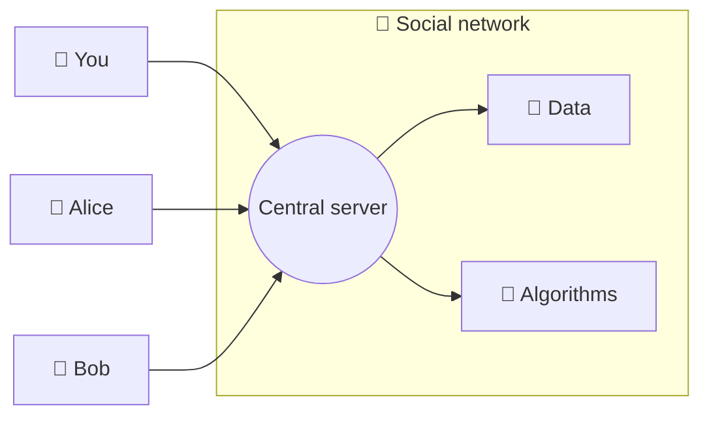
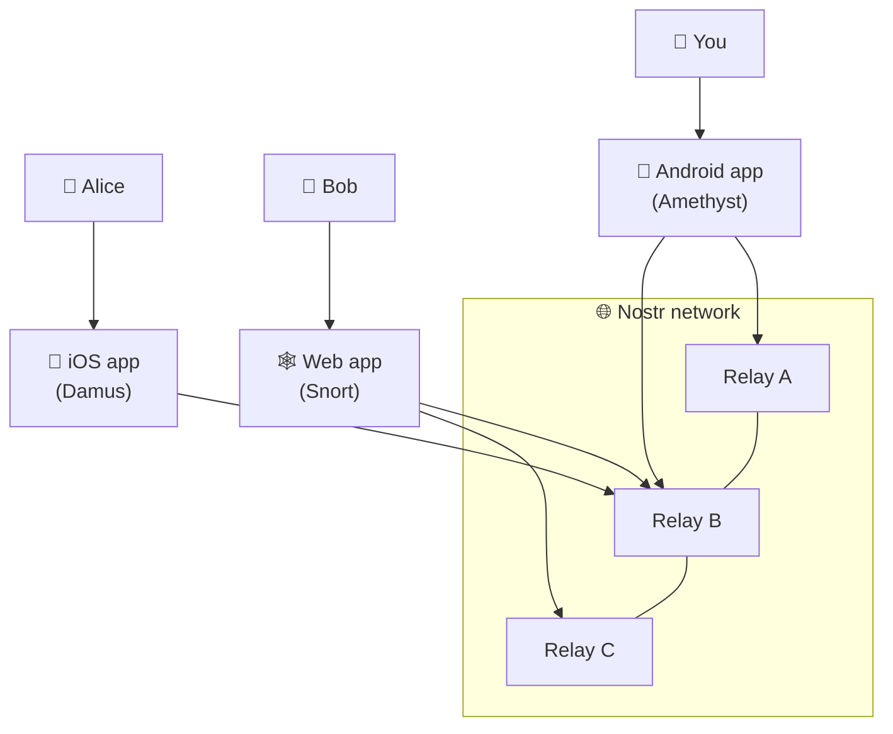
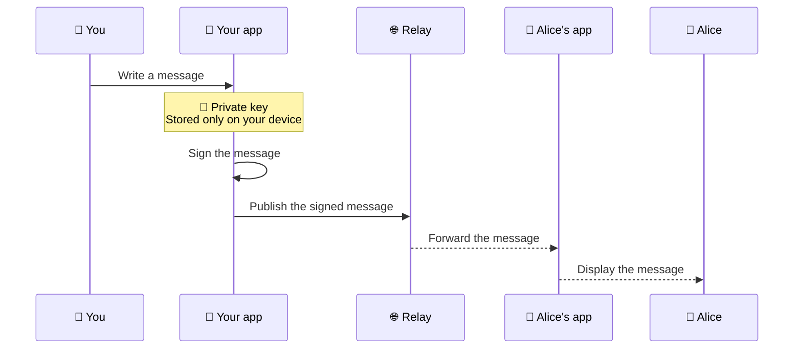

> [!IMPORTANT]
> Today's Internet relies heavily on large platforms that centralize much of our online communication: social networks, messaging services, publishing platforms, and online communities. Nostr takes a different approach by offering an open protocol for publishing and exchanging information without depending on a single server or company. Designed as a simple, decentralized infrastructure, Nostr gives users greater control over their digital identity and content.

{{toc}}

## What is Nostr?

Nostr stands for **Notes and Other Stuff Transmitted by Relays**. It is not a social network itself, but rather a **protocol**: a set of rules that allows different applications to communicate with one another.

Just as the web uses HTTP and email uses SMTP, Nostr defines a standardized way for users to exchange information.

Its goal is to allow everyone to:

- own their digital identity;
- publish content without relying on a centralized platform;
- choose the applications they want to use;
- keep their social network even when switching applications.

> [!NOTE]
> Nostr is not an application. It is a technology on which many different applications can be built.

## Why a New Protocol?

Traditional social networks generally rely on a centralized architecture:

This architecture provides a simple user experience, but it also creates a dependency on a single platform.

A company can change its rules, restrict access to an account, or alter how content is distributed.

Nostr offers a different architecture:

In this model, users communicate through multiple independent relays.

## How Does Nostr Work?

Nostr is built around three core concepts:

- cryptographic identities;
- events;
- relays.

## A Digital Identity Based on Cryptography

Instead of a traditional account tied to an email address and password, Nostr uses a key pair:

- a private key, kept secret;
- a public key, used as your identifier.

The private key is used to sign messages and prove their authenticity.

## Events

In Nostr, every action is represented as an event:

- publishing a post;
- reacting to content;
- following another user;
- updating a profile;
- sharing content.

Each event contains, among other things:

- an author;
- content;
- a timestamp;
- a cryptographic signature.

## Relays

Relays are servers that transport events.

They can:

- receive messages;
- store data;
- distribute content.

A user can connect to multiple relays simultaneously.

> [!TIP]
> This architecture makes it possible to run public, private, or specialized relays depending on specific needs.

## Using Nostr Every Day

Getting started with Nostr is straightforward:

1. choose a compatible application;
2. create an identity;
3. follow other users;
4. publish your first posts.

The experience is similar to using a traditional social network, except that your identity belongs to you rather than to a platform.

## The Benefits of Nostr

### A Portable Identity

Your identity stays with you, even if you switch to another application.

### An Open Protocol

Anyone can build:

- an application;
- a relay;
- an additional service.

### A Distributed Infrastructure

The network does not rely on a single server.

### New Possibilities

Nostr can serve as the foundation for:

- decentralized social networks;
- specialized communities;
- publishing platforms;
- innovative online services.

## The Limitations of Nostr

### Key Management

Your private key is essential.

> [!WARNING]
> Your Nostr private key must always remain secret. Losing it may result in permanently losing access to your identity.

### A Technology Still Maturing

Creating an identity and understanding how relays work can require some learning for newcomers.

### Moderation

There is no single central moderation authority.

Instead, applications and relays implement their own moderation and filtering policies.

## Nostr and Open Technologies

| Technology                  | Approach                                                    |
| --------------------------- | ----------------------------------------------------------- |
| Email                       | Multiple providers interoperating through a shared protocol |
| Web                         | Independent websites connected through open standards       |
| Nostr                       | Identities and messages exchanged through an open protocol  |
| Traditional social networks | A single platform generally controls user accounts          |

The core principle behind Nostr is the separation of the protocol from the applications built on top of it.

## What Does the Future Hold for Nostr?

Nostr is still an emerging technology.

Its future will largely depend on its ability to become accessible to mainstream users while preserving its core principles:

- openness;
- portability;
- user ownership;
- independence from any single platform.

## Learn More

If you'd like to discover Nostr in practice, a [dedicated tutorial](<%= tutorial_path("nostr-social-network") %>) is already available on this site to help you get started.

The guide explains how to start using Nostr with the Snort web client, create your identity, configure your first relays, and publish your first posts.

Once you've mastered the basics, you'll be ready to explore the many applications compatible with Nostr and discover an ecosystem that continues to evolve.

## Useful Links

- Official Nostr website: https://nostr.com/
- Find Twitter contacts who have joined Nostr: https://nostr.directory/
- Nostr protocol specifications (NIPs): https://github.com/nostr-protocol/nips
- Nostr resources: https://nostr.net/
- Primal web client: https://primal.net/
- Amethyst Android client: https://amethyst.social/
- Damus iOS client: https://damus.io/
